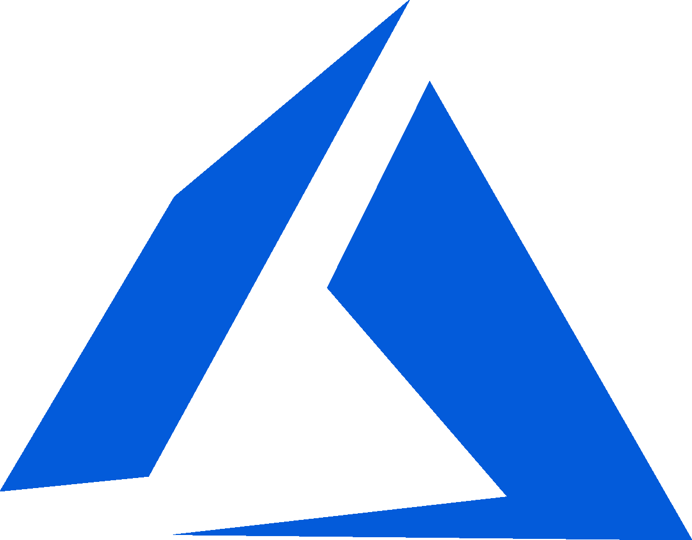
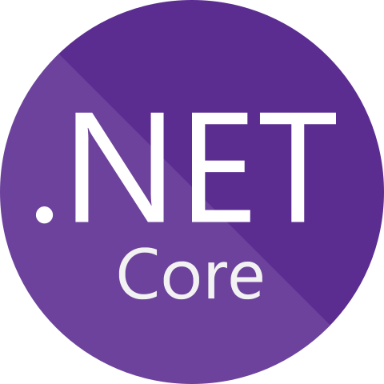
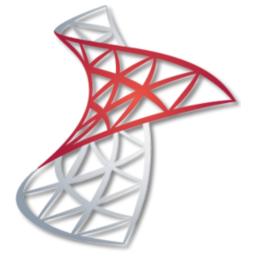
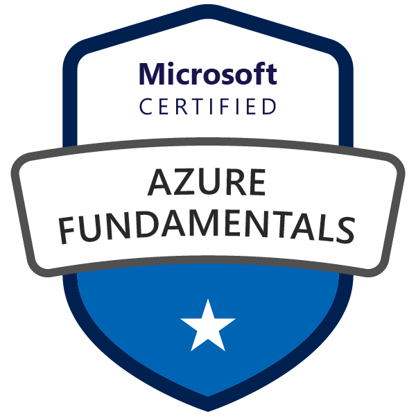
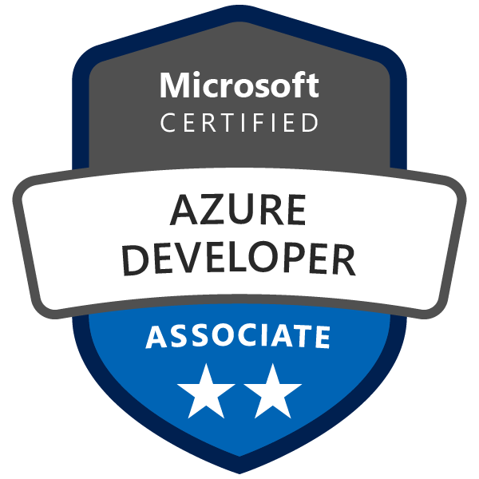

### Hi, I'm Manoj Bhargavan  

#### Skills/Learning 
                

#### Certified

- 👯 I’m looking to collaborate on challenging enterprise projects, frameworks, and tools for developers.
- 🤔 I’m looking for help with finding time for all of the good stuff.
- 💬 Ask me about .NET, Azure, Finance / Anything.

